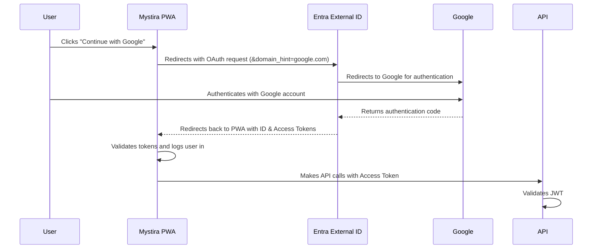

# Microsoft Entra External ID Setup Guide for Mystira

**Date**: December 22, 2025  
**Author**: Manus AI

---

## 1. Overview

This guide provides a comprehensive walkthrough for setting up Microsoft Entra External ID (formerly Azure AD B2C) for the Mystira platform. This includes infrastructure provisioning with Terraform, tenant configuration, Google federation, and application setup for both the Blazor WebAssembly PWA and the backend API.

### 1.1. Architecture

The authentication flow uses the OAuth 2.0 implicit grant flow with a redirect. The user is redirected to Entra External ID, authenticates with Google, and is then redirected back to the application with an ID token and an access token.



### 1.2. Key Configuration Values

| Setting         | Value                                                 | Source                        |
|-----------------|-------------------------------------------------------|-------------------------------|
| **Tenant ID**     | `a816d461-fbf8-4477-83a6-a62ad74ff28f`                | Entra Admin Center            |
| **Domain**        | `mystira.ciamlogin.com`                               | Entra Admin Center            |
| **Authority**     | `https://mystira.ciamlogin.com/{TENANT_ID}`           | **Note:** No `/v2.0` suffix     |
| **PWA Client ID** | `768ac1c6-47f4-4449-b57a-f3fe4016b006`                | Terraform Output              |
| **Redirect URI**  | `http://localhost:5173/authentication/login-callback` | PWA `appsettings.json`        |

---

## 2. Infrastructure Setup (Terraform)

The first step is to provision the necessary Azure resources using the provided Terraform module in the `Mystira.workspace` repository.

### 2.1. Prerequisites

- Azure CLI installed and authenticated
- Terraform CLI installed

### 2.2. Deployment Steps

1.  **Navigate to the Terraform test directory**:
    ```bash
    cd /home/ubuntu/Mystira.workspace/infra/terraform/modules/azure-ad-b2c/test
    ```

2.  **Initialize Terraform**:
    ```bash
    terraform init
    ```

3.  **Plan the deployment**:
    ```bash
    terraform plan
    ```

4.  **Apply the changes**:
    ```bash
    terraform apply
    ```

This will create the following resources:
-   **App Registration for PWA**: For the Blazor WebAssembly application.
-   **App Registration for Public API**: For the backend API.
-   **App Registration for Mobile**: For the future mobile application.

### 2.3. Terraform Outputs

After the deployment, Terraform will output the client IDs for the created applications. These are needed for the PWA and API configuration.

```bash
terraform output pwa_client_id
terraform output public_api_client_id
```

---

## 3. Google Cloud Console Setup

To enable Google as an identity provider, you need to configure an OAuth 2.0 client ID in the Google Cloud Console.

### 3.1. Create OAuth Client ID

1.  Navigate to the [Google Cloud Console Credentials page](https://console.cloud.google.com/apis/credentials).
2.  Select your project.
3.  Click **+ CREATE CREDENTIALS** and select **OAuth client ID**.
4.  For **Application type**, select **Web application**.
5.  Give it a name, e.g., "Mystira Entra External ID".

### 3.2. Configure Redirect URIs

This is the most critical step. You must add all 7 of the following redirect URIs to the **Authorized redirect URIs** section:

```
https://login.microsoftonline.com
https://login.microsoftonline.com/te/a816d461-fbf8-4477-83a6-a62ad74ff28f/oauth2/authresp
https://login.microsoftonline.com/te/mystira.onmicrosoft.com/oauth2/authresp
https://a816d461-fbf8-4477-83a6-a62ad74ff28f.ciamlogin.com/a816d461-fbf8-4477-83a6-a62ad74ff28f/federation/oidc/accounts.google.com
https://a816d461-fbf8-4477-83a6-a62ad74ff28f.ciamlogin.com/mystira.onmicrosoft.com/federation/oidc/accounts.google.com
https://mystira.ciamlogin.com/a816d461-fbf8-4477-83a6-a62ad74ff28f/federation/oauth2
https://mystira.ciamlogin.com/mystira.onmicrosoft.com/federation/oauth2
```

### 3.3. Configure Authorized Domains

Add the following domains to the **Authorized domains** section of the OAuth consent screen:

-   `ciamlogin.com`
-   `microsoftonline.com`

### 3.4. Get Client ID and Secret

After creating the client ID, take note of the **Client ID** and **Client secret**. These are needed for the Entra External ID configuration.

---

## 4. Entra External ID Configuration

Now, configure Google as an identity provider in your Entra External ID tenant.

1.  Navigate to the [Microsoft Entra admin center](https://entra.microsoft.com/).
2.  Go to **External Identities** > **All identity providers**.
3.  Next to **Google**, click **Configure**.
4.  Enter the **Client ID** and **Client secret** from the Google Cloud Console.
5.  Save the configuration.
6.  Go to **User flows** and ensure that Google is enabled as an identity provider for your sign-up and sign-in user flow.

---

## 5. PWA Configuration

Configure the Blazor PWA to use the Entra External ID authentication.

### 5.1. `appsettings.Development.json`

Update `src/Mystira.App.PWA/wwwroot/appsettings.Development.json` with the correct values:

```json
{
  "MicrosoftEntraExternalId": {
    "Authority": "https://mystira.ciamlogin.com/a816d461-fbf8-4477-83a6-a62ad74ff28f",
    "ClientId": "<YOUR_PWA_CLIENT_ID_FROM_TERRAFORM>",
    "RedirectUri": "http://localhost:5173/authentication/login-callback"
  }
}
```

### 5.2. `Program.cs`

Ensure that `EntraExternalIdAuthService` is registered as the `IAuthService` implementation in `src/Mystira.App.PWA/Program.cs`:

```csharp
builder.Services.AddScoped<IAuthService, EntraExternalIdAuthService>();
```

### 5.3. UI Implementation

The "Continue with Google" buttons in `SignIn.razor` and `SignUp.razor` call the `LoginWithEntraAsync` method with a `domain_hint` to redirect directly to Google:

```csharp
await entraService.LoginWithEntraAsync("google.com");
```

---

## 6. API Configuration

Configure the backend API to validate JWTs issued by Entra External ID.

### 6.1. `appsettings.json`

Update the `JwtSettings` in the API's `appsettings.json`:

```json
{
  "JwtSettings": {
    "JwksEndpoint": "https://mystira.ciamlogin.com/a816d461-fbf8-4477-83a6-a62ad74ff28f/discovery/v2.0/keys",
    "Issuer": "https://mystira.ciamlogin.com/a816d461-fbf8-4477-83a6-a62ad74ff28f/v2.0",
    "Audience": "<YOUR_PUBLIC_API_CLIENT_ID_FROM_TERRAFORM>"
  }
}
```

### 6.2. Protecting Endpoints

Use the `[Authorize]` attribute to protect your API endpoints:

```csharp
[Authorize]
[HttpGet("profile")]
public async Task<IActionResult> GetProfile()
{
    var userId = User.FindFirst(ClaimTypes.NameIdentifier)?.Value;
    // ...
}
```

---

## 7. Troubleshooting

-   **`redirect_uri` mismatch error**: Ensure all 7 redirect URIs are correctly entered in the Google Cloud Console.
-   **Entra sign-in page still showing**: This is a known limitation of Entra External ID; the `domain_hint` is not always honored. The current implementation is correct.
-   **404 errors**: Double-check that the `Authority` in `appsettings.json` does **not** have a `/v2.0` suffix.

