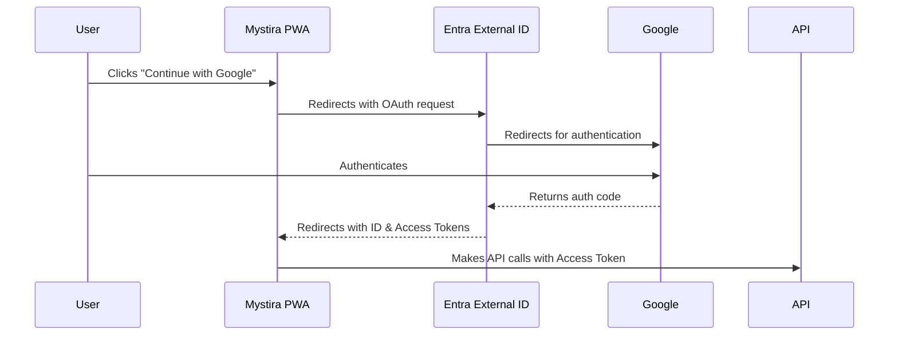

# Mystira Platform Authentication

**Date**: December 22, 2025  
**Author**: Manus AI

---

## 1. Overview

This directory contains all documentation related to authentication and authorization for the Mystira platform. The primary authentication method is **Microsoft Entra External ID**, which provides a secure and scalable solution for managing user identities.

### 1.1. Key Documents

| Document | Description |
|---|---|
| [**Setup Guide**](./ENTRA_EXTERNAL_ID_SETUP_GUIDE.md) | A complete, step-by-step guide to configuring the entire authentication stack, from infrastructure to application code. |
| [**Troubleshooting & FAQ**](./TROUBLESHOOTING_FAQ.md) | Solutions for common problems, debugging tips, and frequently asked questions. |

---

## 2. Authentication Architecture

The platform uses an OAuth 2.0 redirect flow with Microsoft Entra External ID as the central identity provider, federated with Google for social login.

---

## 3. Technical Debt & Future Improvements

### 3.1. MSAL Popup Authentication

The current implementation uses a full-page redirect for authentication. A superior user experience can be achieved by using the `Microsoft.Authentication.WebAssembly.Msal` library to perform logins in a popup window.

-   **Challenge**: The existing `IAuthService` interface is not compatible with the asynchronous nature of popup methods.
-   **Recommendation**: Refactor `IAuthService` and implement MSAL's popup functionality.

### 3.2. Authorization Code Flow with PKCE

The current implicit flow is suitable for SPAs but is less secure than the Authorization Code Flow with PKCE. Migrating to PKCE would provide an extra layer of security.

-   **Recommendation**: Plan a migration to the PKCE flow for enhanced security.

---

## 4. Legacy Documentation

The following documents are considered legacy and will be archived. Their content has been consolidated and updated in the new [Setup Guide](./ENTRA_EXTERNAL_ID_SETUP_GUIDE.md).

-   `ENTRA_EXTERNAL_ID_INTEGRATION.md`
-   `ENTRA_EXTERNAL_ID_PWA_SETUP.md`
-   `ENTRA_EXTERNAL_ID_API_SETUP.md`
