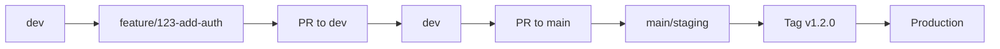

# Git Branching Strategy

This document outlines our Git branching strategy and workflow for development and releases.

## Branch Structure

```
main (protected)
  │
  ├── dev (default development branch)
  │     │
  │     └── feature/* (feature branches)
  │     └── bugfix/* (bug fix branches)
  │     └── claude/* (AI-assisted development branches)
  │
  └── tags: v*.*.* (release tags for production)
```

## Branch Types

### Main Branch (`main`)

- **Purpose**: Production-ready code and staging deployments
- **Protection**: Protected, requires PR approval
- **Deployment**: Merges to `main` auto-deploy to **staging**
- **Tags**: Production releases are created via tags on `main`

### Development Branch (`dev`)

- **Purpose**: Active development and integration
- **Protection**: Protected, requires PR approval
- **Deployment**: Auto-deploys to **development** environment
- **Source**: Feature and bugfix branches merge here first

### Feature Branches (`feature/*`)

- **Purpose**: New feature development
- **Naming**: `feature/[issue-number]-short-description`
- **Source**: Branch from `dev`
- **Target**: Merge back to `dev` via PR

### Bugfix Branches (`bugfix/*`)

- **Purpose**: Bug fixes and patches
- **Naming**: `bugfix/[issue-number]-short-description`
- **Source**: Branch from `dev` (or `main` for hotfixes)
- **Target**: Merge back to `dev` via PR

### AI-Assisted Branches (`claude/*`)

- **Purpose**: Branches created by Claude Code AI assistant
- **Naming**: `claude/[task-description]-[session-id]`
- **Source**: Branch from `dev`
- **Target**: Merge back to `dev` via PR

## Workflow

### Feature Development



### Step-by-Step Process

1. **Create Feature Branch**
   ```bash
   git checkout dev
   git pull origin dev
   git checkout -b feature/123-add-authentication
   ```

2. **Develop and Commit**
   ```bash
   git add .
   git commit -m "feat: add user authentication flow"
   git push -u origin feature/123-add-authentication
   ```

3. **Create PR to dev**
   - Open Pull Request targeting `dev` branch
   - Request code review
   - Address feedback
   - Merge when approved

4. **Validate in Development**
   - PR merge triggers auto-deploy to dev environment
   - Test changes in dev environment
   - Fix any issues found

5. **Promote to Staging**
   - Create PR from `dev` to `main`
   - Review accumulated changes
   - Merge triggers auto-deploy to staging

6. **Release to Production**
   - Test thoroughly in staging
   - Create release tag: `git tag -a v1.2.0 -m "Release 1.2.0"`
   - Push tag: `git push origin v1.2.0`
   - Tag triggers production deployment

## Environment Mapping

| Branch/Tag | Environment | Auto-Deploy |
|------------|-------------|-------------|
| `dev` | Development | Yes |
| `main` | Staging | Yes |
| `v*.*.*` tags | Production | Yes |

## Commit Message Convention

Follow [Conventional Commits](https://www.conventionalcommits.org/):

```
<type>(<scope>): <description>

[optional body]

[optional footer(s)]
```

### Types

| Type | Description |
|------|-------------|
| `feat` | New feature |
| `fix` | Bug fix |
| `docs` | Documentation only |
| `style` | Code style (formatting, etc.) |
| `refactor` | Code refactoring |
| `perf` | Performance improvement |
| `test` | Adding/fixing tests |
| `chore` | Maintenance tasks |
| `ci` | CI/CD changes |

### Examples

```bash
feat(auth): add OAuth2 login support
fix(api): resolve null reference in user endpoint
docs(readme): update installation instructions
ci(workflow): add staging deployment pipeline
```

## Hotfix Process

For critical production issues:

1. Create hotfix branch from `main`:
   ```bash
   git checkout main
   git checkout -b bugfix/critical-security-fix
   ```

2. Fix the issue and create PR to `main`

3. After merge to `main`, create patch release tag:
   ```bash
   git tag -a v1.2.1 -m "Hotfix: Critical security fix"
   git push origin v1.2.1
   ```

4. Back-merge to `dev`:
   ```bash
   git checkout dev
   git merge main
   git push origin dev
   ```

## Branch Protection Rules

### Main Branch

- Require pull request reviews (1 minimum)
- Require status checks to pass
- Require linear history (squash merge)
- No direct pushes

### Dev Branch

- Require pull request reviews (1 minimum)
- Require status checks to pass
- Allow squash or regular merge

## Best Practices

1. **Keep branches short-lived** - Merge frequently to avoid conflicts
2. **Rebase before merging** - Keep history clean
3. **Delete merged branches** - Clean up after merge
4. **Use descriptive names** - Include issue numbers when applicable
5. **Commit often** - Small, focused commits are easier to review
6. **Test before PR** - Run tests locally before requesting review
