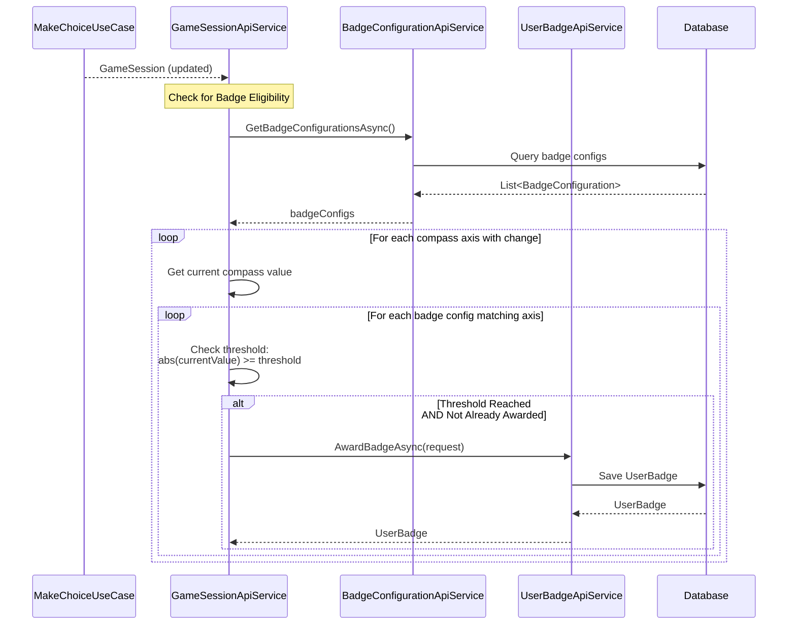

# Badge Use Cases

This directory contains documentation for badge and achievement management.

## Overview

Badges represent achievements earned by user profiles based on compass values, choices, and session completion. Badge management is currently handled through services rather than dedicated use cases, but follows the same architectural patterns.

## Badge Flow

Badges are awarded when:

- **Compass Thresholds**: Compass values reach configured thresholds
- **Session Completion**: User completes a scenario
- **Echo Reveals**: Specific echoes are revealed
- **Consistent Choices**: Multiple choices in same direction

## Current Implementation

Badge operations are handled through services:

### Award Badge (via `UserBadgeApiService`)

- Verifies badge configuration exists
- Verifies user profile exists
- Creates `UserBadge` record
- Links to game session and scenario

### Get User Badges (via `UserBadgeApiService`)

- Retrieves all badges for a user profile
- Includes badge configuration details
- Sorted by earned date

### Badge Configuration Management (via `BadgeConfigurationApiService`)

- CRUD operations for badge configurations
- Defines thresholds, axes, names, messages
- Links to media assets (badge images)

## Badge Checking Flow

Badge checking happens in the service layer after use case execution:

## Badge Configuration

Badge configurations define:

- **Name**: Badge display name
- **Message**: Badge description
- **Axis**: Compass axis this badge tracks
- **Threshold**: Value threshold to earn badge
- **ImageId**: Media asset ID for badge image

## Badge Types

### Compass Threshold Badges

- Awarded when compass value reaches threshold
- Most common badge type
- Linked to specific compass axis

### Session Completion Badges

- Awarded when scenario is completed
- Can be scenario-specific or general

### Echo Reveal Badges

- Awarded when specific echoes are revealed
- Linked to echo types and strengths

## Future Use Case Implementation

Consider creating dedicated use cases:

- `AwardBadgeUseCase` - Encapsulate badge awarding logic
- `CheckBadgeEligibilityUseCase` - Check if user qualifies for badges
- `GetUserBadgesUseCase` - Retrieve user badges with filtering

## Related Components

- **Domain Models**: `UserBadge`, `BadgeConfiguration`, `CompassTracking`
- **Repositories**: `IUserBadgeRepository`, `IBadgeConfigurationRepository`
- **Services**: `UserBadgeApiService`, `BadgeConfigurationApiService`, `GameSessionApiService`
- **DTOs**: `AwardBadgeRequest`, `UserBadgeResponse`, `BadgeConfigurationRequest`

## Related Documentation

- [Make Choice Use Case](../gamesessions/make-choice.md) - Shows badge checking integration
- [Badge Domain Models](../../domain/models/badge.md)
- [Compass Tracking](../../domain/models/compass-tracking.md)
