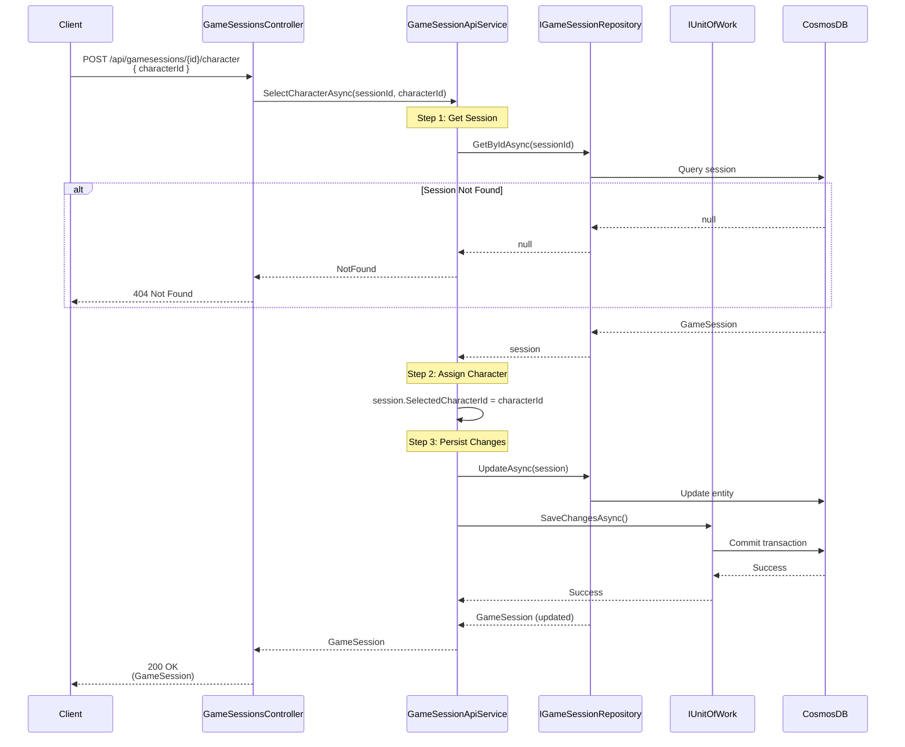

# Assign Player to Character Use Case

## Overview

The `SelectCharacterAsync` method in `GameSessionApiService` assigns a player (profile) to a character in a scenario. This links a user profile to a scenario character for character replacement in text.

## Use Case Details

**Class**: `Mystira.App.Api.Services.GameSessionApiService` (Service Layer)

**Input**: `string sessionId`, `string characterId`

**Output**: `GameSession?` (domain model, null if not found)

**Status**: Currently in production

## Sequence Diagram

## Use Case Flow

### 1. Session Retrieval

- Loads session from database by ID
- Returns null if session doesn't exist

### 2. Character Assignment

- Sets `SelectedCharacterId` to the provided character ID
- Character ID should reference a character from the scenario's character list

### 3. Persistence

- Updates session in database
- Commits transaction

## Character Assignment Flow

The full character assignment flow involves:

1. **Character Selection Page**: User selects which profile/player is assigned to which character
2. **Character Assignment**: This use case assigns the selected character to the session
3. **Text Replacement**: During gameplay, character placeholders `[c:CharacterName]` are replaced with player names

## Character Assignment Data Structure

Character assignments are managed in the PWA layer:

- **CharacterAssignment**: Links a scenario character to a player profile
- **PlayerAssignment**: Contains profile ID and name
- **Character Slots**: Up to 4 character slots per scenario

## Integration Points

### PWA Layer

- `CharacterAssignmentService`: Manages character assignment UI and data
- `GameSessionService`: Handles character assignment for text replacement
- `CharacterAssignmentPage`: UI for selecting character assignments

### API Layer

- `SelectCharacterAsync`: Assigns character to session
- `GameSession.SelectedCharacterId`: Stores the assigned character ID

## Text Replacement

After character assignment, text replacement occurs:

- `[c:CharacterName]` → Player's profile name
- Example: `[c:Elarion]` → "Alice" (if Alice is assigned to Elarion)

## Error Handling

- **Session Not Found**: Returns `null` (handled as 404)
- **Database Error**: Logs error and rethrows exception

## Related Documentation

- [Create Game Session Use Case](./create-game-session.md)
- [Character Map Domain Model](../../domain/models/character-map.md)
- [Scenario Domain Model](../../domain/models/scenario.md)
