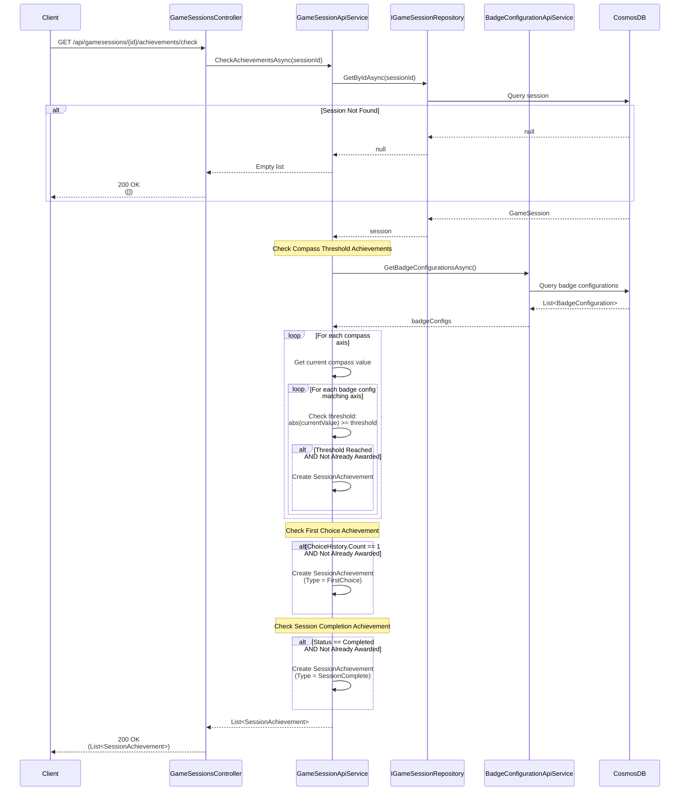

# Check Achievements Use Case

## Overview

The `CheckAchievementsAsync` method in `GameSessionApiService` checks if a game session qualifies for any achievements based on compass values, choice history, and session status.

## Use Case Details

**Class**: `Mystira.App.Api.Services.GameSessionApiService` (Service Layer)

**Input**: `string sessionId`

**Output**: `List<SessionAchievement>` (new achievements found)

**Status**: Currently in production (should be migrated to use case)

## Sequence Diagram

## Achievement Types

### Compass Threshold Achievements

- **Trigger**: Compass value reaches configured threshold
- **Check**: `abs(CompassTracking.CurrentValue) >= BadgeConfiguration.Threshold`
- **Prevention**: Check if achievement already exists in session

### First Choice Achievement

- **Trigger**: First choice made in session
- **Check**: `ChoiceHistory.Count == 1`
- **Prevention**: Check if achievement already exists

### Session Completion Achievement

- **Trigger**: Session completed
- **Check**: `Status == SessionStatus.Completed`
- **Prevention**: Check if achievement already exists

## Achievement Creation

Each achievement includes:

- `Id` - Unique identifier (format: `{sessionId}_{type}_{identifier}`)
- `Title` - Achievement title
- `Description` - Achievement description
- `IconName` - Icon identifier
- `Type` - Achievement type enum
- `CompassAxis` - Axis (for compass-based achievements)
- `ThresholdValue` - Threshold reached
- `EarnedAt` - Timestamp

## Badge Configuration Integration

**Current**: Uses hardcoded threshold (3.0f)

**Future Enhancement**: Should use `BadgeConfigurationApiService`:
- Get badge configurations for session's age group
- Check thresholds dynamically
- Link to badge configurations

## Migration to Use Case

**Recommended**: Create `CheckAchievementsUseCase` in `Application.UseCases.GameSessions`

**Benefits**:

- Integrate with BadgeConfigurationApiService
- Add more achievement types
- Better testability
- Consistent with other use cases
- Separate achievement logic from service

## Integration with Make Choice

Currently called after `MakeChoiceUseCase` completes:
- Checks for new achievements
- Adds achievements to session
- Persists session with achievements

## Related Documentation

- [Make Choice Use Case](./make-choice.md)
- [Badge Use Cases](../badges/README.md)
- [Compass Domain Model](../../domain/models/compass.md)

