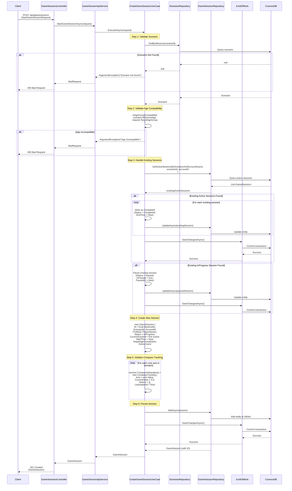
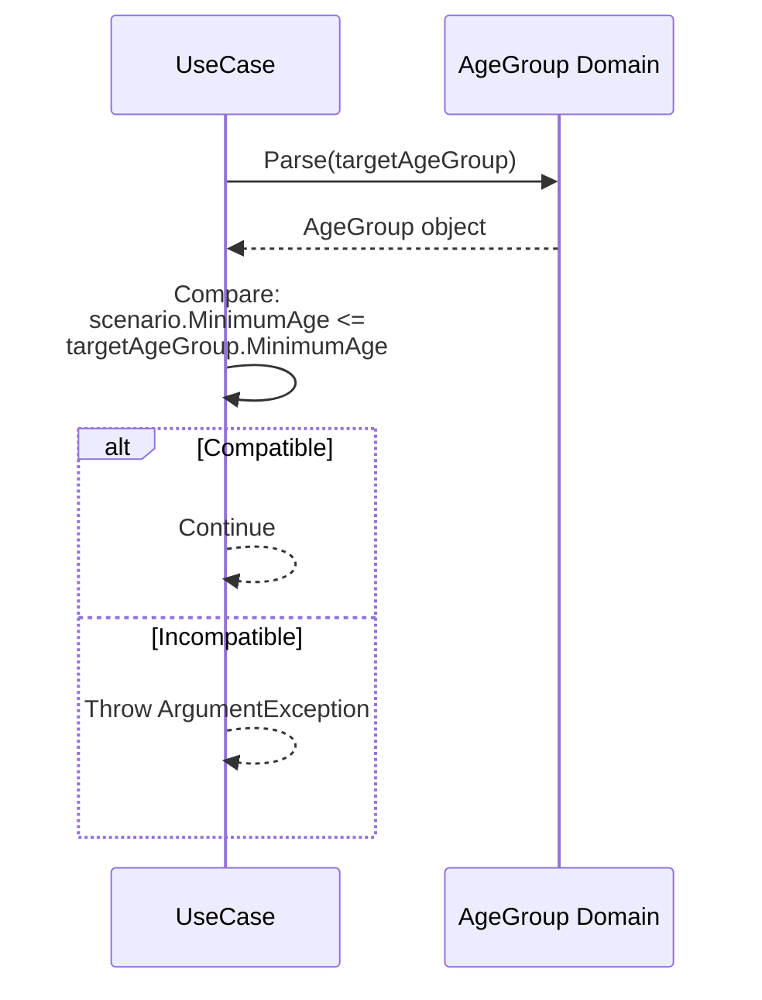

# Create Game Session Use Case

## Overview

The `CreateGameSessionUseCase` handles starting a new game session, including validation, existing session management, and compass initialization.

## Use Case Details

**Class**: `Mystira.App.Application.UseCases.GameSessions.CreateGameSessionUseCase`

**Input**: `StartGameSessionRequest`

**Output**: `GameSession` (domain model)

## Sequence Diagram

## Age Compatibility Validation

The use case validates that the scenario's minimum age is compatible with the target age group:

## Existing Session Handling

The use case handles multiple scenarios for existing sessions:

1. **Auto-Complete**: Any existing active sessions for the same scenario and account are marked as completed
2. **Pause**: If an InProgress session exists, it's paused before creating a new one
3. **New Session**: A fresh session is created with initial state

## Compass Initialization

For each core axis defined in the scenario:

- Creates a `CompassTracking` object
- Initializes `CurrentValue` to 0.0
- Creates empty history list
- Sets `LastUpdated` to current time

This ensures all compass axes are tracked from the start of the session.

## Error Handling

- **Scenario Not Found**: Returns `ArgumentException` with scenario ID
- **Age Incompatible**: Returns `ArgumentException` with age details
- **Database Error**: Logs error and rethrows exception

## Related Documentation

- [Make Choice Use Case](./make-choice.md)
- [Game Session Domain Model](../../domain/models/game-session.md)
- [Compass Tracking](../../domain/models/compass-tracking.md)
