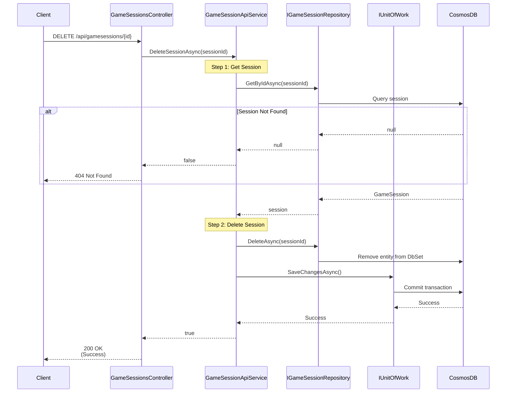

# Delete Game Session Use Case

## Overview

The `DeleteSessionAsync` method in `GameSessionApiService` handles deletion of game sessions.

## Use Case Details

**Class**: `Mystira.App.Api.Services.GameSessionApiService` (Service Layer)

**Input**: `string sessionId`

**Output**: `bool` (true if deleted, false if not found)

**Status**: Currently in production (should be migrated to use case)

## Sequence Diagram

## Use Case Flow

### 1. Session Retrieval

- Loads session from database by ID
- Returns false if session doesn't exist

### 2. Deletion

- Deletes session from database
- Commits transaction

## Behavior

- **Idempotent**: Returns `false` if session doesn't exist (not an error)
- **Transactional**: Deletion is atomic
- **Logged**: Logs deletion with session ID

## Cascading Behavior

Currently, deletion does not cascade to:

- User badges earned in the session (badges remain)
- Compass tracking data (if stored separately)

**Note**: Consider cascade deletion or soft deletion if referential integrity is required.

## Authorization

**Current**: No explicit authorization check

**Future Enhancement**: Should verify:

- Requesting user owns the account that owns the session
- Parent users can delete child profile sessions (COPPA compliance)
- Admin users can delete any session

## Migration to Use Case

**Recommended**: Create `DeleteGameSessionUseCase` in `Application.UseCases.GameSessions`

**Benefits**:

- Add authorization logic
- Add cascade deletion logic
- Add soft deletion option
- Consistent with other use cases

## Related Documentation

- [Create Game Session Use Case](./create-game-session.md)
- [End Game Session Use Case](./end-game-session.md)
- [Game Session Domain Model](../../domain/models/game-session.md)
