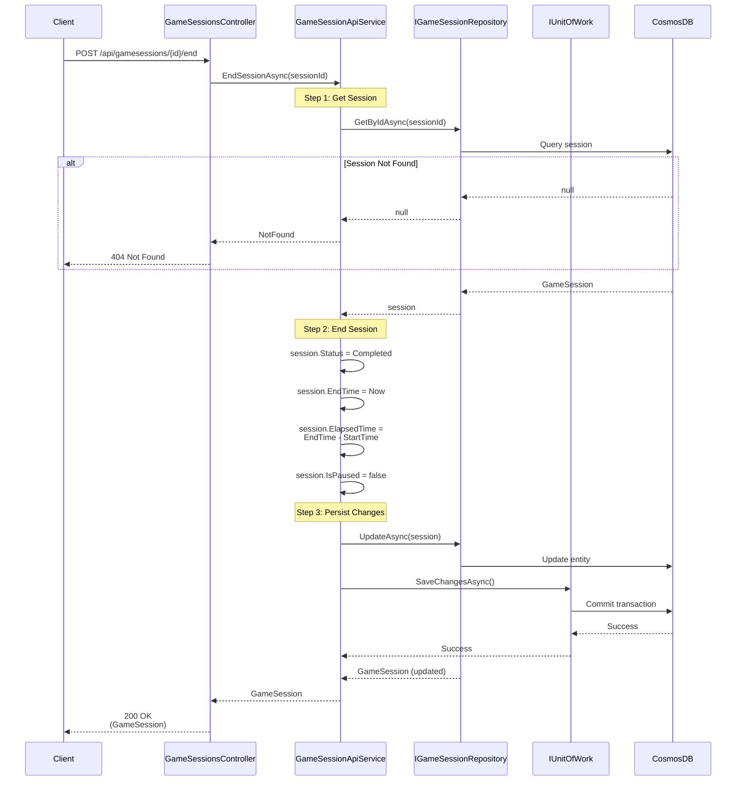

# End Game Session Use Case

## Overview

The `EndSessionAsync` method in `GameSessionApiService` handles manually ending a game session, marking it as completed.

## Use Case Details

**Class**: `Mystira.App.Api.Services.GameSessionApiService` (Service Layer)

**Input**: `string sessionId`

**Output**: `GameSession?` (domain model, null if not found)

**Status**: Currently in production

## Sequence Diagram



## Use Case Flow

### 1. Session Retrieval

- Loads session from database by ID
- Returns null if session doesn't exist

### 2. End Operation

- Changes status to `Completed`
- Sets `EndTime` to current UTC time
- Calculates `ElapsedTime` as difference between `EndTime` and `StartTime`
- Clears `IsPaused` flag (if paused)

### 3. Persistence

- Updates session in database
- Commits transaction

## Use Cases

### Manual Session Completion

User explicitly ends a session before reaching the natural end.

### Session Abandonment

User abandons a session (though this typically uses `Abandoned` status).

### Admin Session Management

Administrators can end sessions for management purposes.

## State Transitions

``` text
InProgress → Completed
Paused → Completed
```

## Elapsed Time Calculation

The elapsed time is calculated as:

``` text
ElapsedTime = EndTime - StartTime
```

This provides the total play time for the session, regardless of pauses.

## Error Handling

- **Session Not Found**: Returns `null` (handled as 404)
- **Database Error**: Logs error and rethrows exception

## Related Documentation

- [Create Game Session Use Case](./create-game-session.md)
- [Resume Game Session Use Case](./resume-game-session.md)
- [Game Session Domain Model](../../domain/models/game-session.md)
