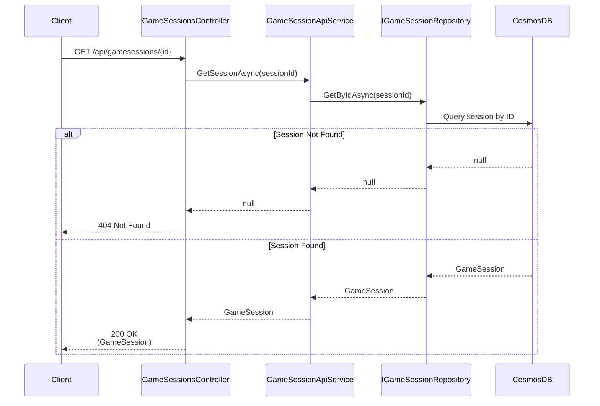

# Get Game Session Use Case

## Overview

The `GetSessionAsync` method in `GameSessionApiService` retrieves a game session by ID.

## Use Case Details

**Class**: `Mystira.App.Api.Services.GameSessionApiService` (Service Layer)

**Input**: `string sessionId`

**Output**: `GameSession?` (domain model, null if not found)

**Status**: Currently in production (should be migrated to use case)

## Sequence Diagram

## Use Case Flow

### 1. Session Retrieval

- Loads session from database by ID
- Returns null if session doesn't exist (not an error)

## Behavior

- **Simple Lookup**: Direct ID-based retrieval
- **Null Handling**: Returns `null` if session not found (handled as 404 by controller)
- **No Authorization**: Currently no authorization checks (should be added)

## Authorization Considerations

**Future Enhancement**: Should verify:
- Session belongs to requesting account
- User has permission to view session
- COPPA compliance (parent access to child profiles)

## Migration to Use Case

**Recommended**: Create `GetGameSessionUseCase` in `Application.UseCases.GameSessions`

**Benefits**:

- Add authorization logic
- Consistent with other use cases
- Better testability
- Clear separation of concerns

## Related Documentation

- [Create Game Session Use Case](./create-game-session.md)
- [Game Session Domain Model](../../domain/models/game-session.md)

