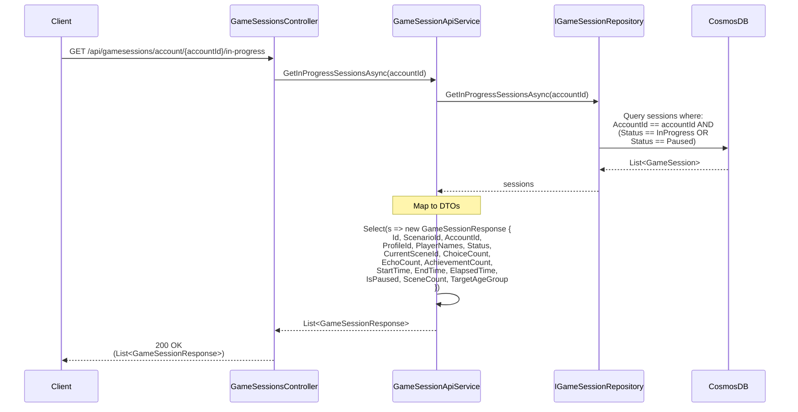

# Get In Progress Sessions Use Case

## Overview

The `GetInProgressSessionsAsync` method in `GameSessionApiService` retrieves all active (in-progress or paused) game sessions for an account.

## Use Case Details

**Class**: `Mystira.App.Api.Services.GameSessionApiService` (Service Layer)

**Input**: `string accountId`

**Output**: `List<GameSessionResponse>` (DTOs, not domain models)

**Status**: Currently in production (should be migrated to use case)

## Sequence Diagram

## Use Case Flow

### 1. Session Retrieval

- Loads all in-progress or paused sessions for the account
- Returns empty list if no active sessions found

### 2. DTO Mapping

- Maps domain models to `GameSessionResponse` DTOs
- Calculates derived values
- Excludes sensitive or large data

## Filtering Logic

Sessions are included if:
- `AccountId` matches
- `Status == SessionStatus.InProgress` OR `Status == SessionStatus.Paused`

## Use Cases

### Active Adventures Display

Used to show "Active Adventures" on the home page:
- Lists all sessions user can resume
- Shows progress and status
- Allows quick navigation to resume sessions

### Session Management

Used for:
- Showing active sessions in dashboard
- Preventing duplicate sessions
- Session cleanup/management

## Authorization

**Current**: No explicit authorization check

**Future Enhancement**: Should verify:
- Requesting user owns the account
- Admin users can view any account's sessions

## Migration to Use Case

**Recommended**: Create `GetInProgressSessionsUseCase` in `Application.UseCases.GameSessions`

**Benefits**:

- Add authorization logic
- Add additional filtering options (by profile, by scenario)
- Add sorting options (by start time, by last activity)
- Consistent with other use cases

## Related Documentation

- [Resume Game Session Use Case](./resume-game-session.md)
- [Get Game Sessions by Account Use Case](./get-sessions-by-account.md)
- [Game Session Domain Model](../../domain/models/game-session.md)

