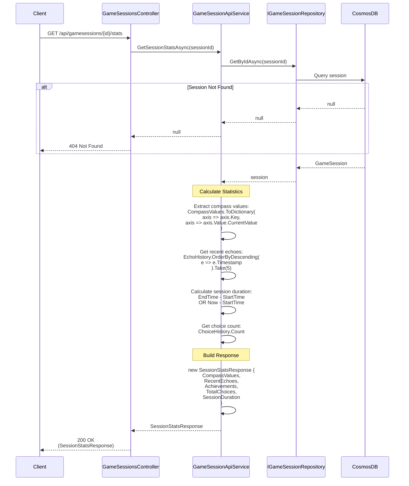

# Get Session Stats Use Case

## Overview

The `GetSessionStatsAsync` method in `GameSessionApiService` retrieves statistics for a game session, including compass values, recent echoes, achievements, and choice counts.

## Use Case Details

**Class**: `Mystira.App.Api.Services.GameSessionApiService` (Service Layer)

**Input**: `string sessionId`

**Output**: `SessionStatsResponse?` (DTO, null if not found)

**Status**: Currently in production (should be migrated to use case)

## Sequence Diagram

## Use Case Flow

### 1. Session Retrieval

- Loads session from database by ID
- Returns null if session doesn't exist

### 2. Statistics Calculation

- **Compass Values**: Extracts current compass value for each axis
- **Recent Echoes**: Gets 5 most recent echoes (ordered by timestamp)
- **Achievements**: Includes all session achievements
- **Total Choices**: Counts choices in history
- **Session Duration**: Calculates elapsed time

### 3. Response Building

- Creates `SessionStatsResponse` DTO
- Includes all calculated statistics

## Response DTO

`SessionStatsResponse` includes:

- `CompassValues` - Dictionary of axis name to current value
- `RecentEchoes` - List of 5 most recent echoes
- `Achievements` - List of all session achievements
- `TotalChoices` - Total number of choices made
- `SessionDuration` - Total elapsed time

## Use Cases

### Session Summary Display

Used to show session progress and statistics:
- Display compass values
- Show recent echoes
- Display achievements earned
- Show choice count and duration

### Analytics

Used for:
- Player progress tracking
- Session analytics
- Performance metrics

## Authorization

**Current**: No explicit authorization check

**Future Enhancement**: Should verify:
- Requesting user owns the account that owns the session
- Parent users can view child profile session stats (COPPA compliance)

## Migration to Use Case

**Recommended**: Create `GetSessionStatsUseCase` in `Application.UseCases.GameSessions`

**Benefits**:

- Add authorization logic
- Add caching for frequently accessed stats
- Add additional statistics (e.g., average choice time, echo strength distribution)
- Consistent with other use cases

## Related Documentation

- [Get Game Session Use Case](./get-game-session.md)
- [Make Choice Use Case](./make-choice.md)
- [Compass Domain Model](../../domain/models/compass.md)

