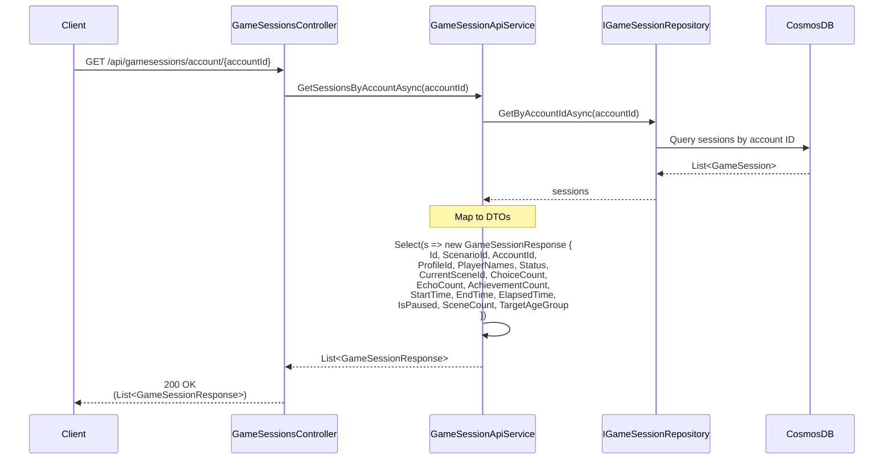

# Get Game Sessions by Account Use Case

## Overview

The `GetSessionsByAccountAsync` method in `GameSessionApiService` retrieves all game sessions for an account.

## Use Case Details

**Class**: `Mystira.App.Api.Services.GameSessionApiService` (Service Layer)

**Input**: `string accountId`

**Output**: `List<GameSessionResponse>` (DTOs, not domain models)

**Status**: Currently in production (should be migrated to use case)

## Sequence Diagram

## Use Case Flow

### 1. Session Retrieval

- Loads all sessions for the account from database
- Returns empty list if no sessions found

### 2. DTO Mapping

- Maps domain models to `GameSessionResponse` DTOs
- Calculates derived values (ChoiceCount, EchoCount, AchievementCount)
- Excludes sensitive or large data (full choice history, echo history)

## Response DTO

`GameSessionResponse` includes:

- Basic session info (Id, ScenarioId, AccountId, ProfileId)
- Status and progress (Status, CurrentSceneId, IsPaused)
- Statistics (ChoiceCount, EchoCount, AchievementCount)
- Timing (StartTime, EndTime, ElapsedTime)
- Metadata (PlayerNames, SceneCount, TargetAgeGroup)

## Authorization

**Current**: No explicit authorization check

**Future Enhancement**: Should verify:
- Requesting user owns the account
- Admin users can view any account's sessions

## Migration to Use Case

**Recommended**: Create `GetGameSessionsByAccountUseCase` in `Application.UseCases.GameSessions`

**Benefits**:

- Add authorization logic
- Add filtering/sorting options
- Add pagination support
- Consistent with other use cases

## Related Documentation

- [Get Game Sessions by Profile Use Case](./get-sessions-by-profile.md)
- [Get In Progress Sessions Use Case](./get-in-progress-sessions.md)
- [Game Session Domain Model](../../domain/models/game-session.md)

