# Make Choice Use Case

## Overview

The `MakeChoiceUseCase` processes a player's choice in a game session, updating session state, recording history, processing echoes, updating compass values, and checking for completion.

## Use Case Details

**Class**: `Mystira.App.Application.UseCases.GameSessions.MakeChoiceUseCase`

**Input**: `MakeChoiceRequest`

**Output**: `GameSession` (updated domain model)

## Sequence Diagram

```mermaid
sequenceDiagram
    participant Client
    participant Controller as GameSessionsController
    participant Service as GameSessionApiService
    participant UseCase as MakeChoiceUseCase
    participant SessionRepo as IGameSessionRepository
    participant ScenarioRepo as IScenarioRepository
    participant BadgeService as UserBadgeApiService
    participant BadgeConfig as BadgeConfigurationApiService
    participant UoW as IUnitOfWork
    participant DB as CosmosDB

    Client->>Controller: POST /api/gamesessions/{id}/choice<br/>(MakeChoiceRequest)
    Controller->>Service: MakeChoiceAsync(sessionId, request)
    
    Service->>UseCase: ExecuteAsync(request)
    
    Note over UseCase: Step 1: Validate Session
    UseCase->>SessionRepo: GetByIdAsync(sessionId)
    SessionRepo->>DB: Query session
    alt Session Not Found
        DB-->>SessionRepo: null
        SessionRepo-->>UseCase: null
        UseCase-->>Service: null
        Service-->>Controller: NotFound
        Controller-->>Client: 404 Not Found
    end
    DB-->>SessionRepo: GameSession
    SessionRepo-->>UseCase: session
    
    alt Session Not InProgress
        UseCase-->>Service: InvalidOperationException
        Service-->>Controller: BadRequest
        Controller-->>Client: 400 Bad Request
    end
    
    Note over UseCase: Step 2: Validate Scenario & Scene
    UseCase->>ScenarioRepo: GetByIdAsync(session.ScenarioId)
    ScenarioRepo->>DB: Query scenario
    DB-->>ScenarioRepo: Scenario
    ScenarioRepo-->>UseCase: scenario
    
    UseCase->>UseCase: Find currentScene<br/>by request.SceneId
    alt Scene Not Found
        UseCase-->>Service: ArgumentException("Scene not found")
        Service-->>Controller: BadRequest
        Controller-->>Client: 400 Bad Request
    end
    
    UseCase->>UseCase: Find branch<br/>by request.ChoiceText
    alt Branch Not Found
        UseCase-->>Service: ArgumentException("Choice not found")
        Service-->>Controller: BadRequest
        Controller-->>Client: 400 Bad Request
    end
    
    Note over UseCase: Step 3: Record Choice
    UseCase->>UseCase: Create SessionChoice {<br/>  SceneId, SceneTitle,<br/>  ChoiceText, NextScene,<br/>  ChosenAt = Now,<br/>  EchoGenerated = branch.EchoLog,<br/>  CompassChange = branch.CompassChange<br/>}
    UseCase->>UseCase: session.ChoiceHistory.Add(choice)
    
    Note over UseCase: Step 4: Process Echo Log
    alt Branch Has EchoLog
        UseCase->>UseCase: Create EchoLog {<br/>  EchoType, Description,<br/>  Strength, Timestamp = Now<br/>}
        UseCase->>UseCase: session.EchoHistory.Add(echo)
    end
    
    Note over UseCase: Step 5: Update Compass Values
    alt Branch Has CompassChange
        UseCase->>UseCase: Get CompassTracking<br/>for branch.CompassChange.Axis
        UseCase->>UseCase: tracking.CurrentValue +=<br/>branch.CompassChange.Delta
        UseCase->>UseCase: Clamp to [-2.0, 2.0]
        UseCase->>UseCase: tracking.History.Add(compassChange)
        UseCase->>UseCase: tracking.LastUpdated = Now
    end
    
    Note over UseCase: Step 6: Update Session State
    UseCase->>UseCase: session.CurrentSceneId =<br/>request.NextSceneId
    UseCase->>UseCase: session.ElapsedTime =<br/>Now - session.StartTime
    
    Note over UseCase: Step 7: Check Completion
    UseCase->>UseCase: Find nextScene<br/>by request.NextSceneId
    alt Next Scene Has No Branches<br/>AND No NextSceneId
        UseCase->>UseCase: session.Status = Completed
        UseCase->>UseCase: session.EndTime = Now
    end
    
    Note over UseCase: Step 8: Persist Changes
    UseCase->>SessionRepo: UpdateAsync(session)
    SessionRepo->>DB: Update entity
    UseCase->>UoW: SaveChangesAsync()
    UoW->>DB: Commit transaction
    DB-->>UoW: Success
    UoW-->>UseCase: Success
    SessionRepo-->>UseCase: GameSession (updated)
    
    UseCase-->>Service: GameSession
    
    Note over Service: Step 9: Check for Badges
    Service->>BadgeConfig: GetBadgeConfigurationsAsync()
    BadgeConfig->>DB: Query badge configurations
    DB-->>BadgeConfig: List<BadgeConfiguration>
    BadgeConfig-->>Service: badgeConfigs
    
    loop For each compass axis with change
        Service->>Service: Get current compass value
        loop For each badge config matching axis
            Service->>Service: Check if threshold reached<br/>(abs(currentValue) >= threshold)
            alt Threshold Reached<br/>AND Badge Not Already Awarded
                Service->>BadgeService: AwardBadgeAsync(new AwardBadgeRequest {<br/>  UserProfileId,<br/>  BadgeConfigurationId,<br/>  TriggerValue = currentValue,<br/>  GameSessionId,<br/>  ScenarioId<br/>})
                BadgeService->>BadgeService: Verify badge config exists
                BadgeService->>BadgeService: Verify user profile exists
                BadgeService->>BadgeService: Create UserBadge
                BadgeService->>DB: Save badge
                DB-->>BadgeService: UserBadge
                BadgeService-->>Service: UserBadge
            end
        end
    end
    
    Service-->>Controller: GameSession
    Controller-->>Client: 200 OK<br/>(GameSession)
```

## Choice Processing Flow

### 1. Validation Phase

- Session exists and is InProgress
- Scenario exists
- Current scene exists in scenario
- Choice text matches a branch in the scene

### 2. Recording Phase

- Creates `SessionChoice` object with all choice metadata
- Adds to `session.ChoiceHistory`

### 3. Echo Processing Phase

- If branch has `EchoLog`, creates echo entry
- Adds to `session.EchoHistory`
- Echo includes type, description, strength, timestamp

### 4. Compass Update Phase

- If branch has `CompassChange`:
  - Updates `CompassTracking.CurrentValue` by adding delta
  - Clamps value to [-2.0, 2.0] range
  - Records change in `CompassTracking.History`
  - Updates `LastUpdated` timestamp

### 5. State Update Phase

- Updates `CurrentSceneId` to next scene
- Updates `ElapsedTime`
- Checks if session is complete (no more branches/scenes)

### 6. Badge Checking Phase (Service Layer)

After use case completes, service checks for badge eligibility:

- Retrieves all badge configurations
- For each compass axis that changed:
  - Checks if current value meets any badge threshold
  - Verifies badge not already awarded
  - Awards badge via `UserBadgeApiService`

## Compass Value Clamping

Compass values are clamped to prevent extreme values:

- Minimum: -2.0
- Maximum: +2.0
- Formula: `Math.Max(-2.0f, Math.Min(2.0f, newValue))`

## Session Completion Detection

A session is marked complete when:

- The next scene has no branches (`Branches.Count == 0`)
- AND the next scene has no `NextSceneId` (`string.IsNullOrEmpty(NextSceneId)`)

## Badge Integration

Badge checking happens in the service layer (not use case) because:

- It requires additional services (`UserBadgeApiService`, `BadgeConfigurationApiService`)
- It's a side effect, not core business logic
- It can be disabled or modified without changing use case

Badge awards are linked to:

- User profile (who earned it)
- Game session (when it was earned)
- Scenario (which scenario it was earned in)
- Compass axis and threshold (what triggered it)

## Error Handling

- **Session Not Found**: Returns `null` (handled by service as 404)
- **Session Not InProgress**: Returns `InvalidOperationException`
- **Scene Not Found**: Returns `ArgumentException` with scene ID
- **Choice Not Found**: Returns `ArgumentException` with choice text
- **Database Error**: Logs error and rethrows exception

## Related Documentation

- [Create Game Session Use Case](./create-game-session.md)
- [Badge Use Cases](../badges/README.md)
- [Compass Tracking](../../domain/models/compass-tracking.md)
- [Echo Logs](../../domain/models/echo-log.md)
