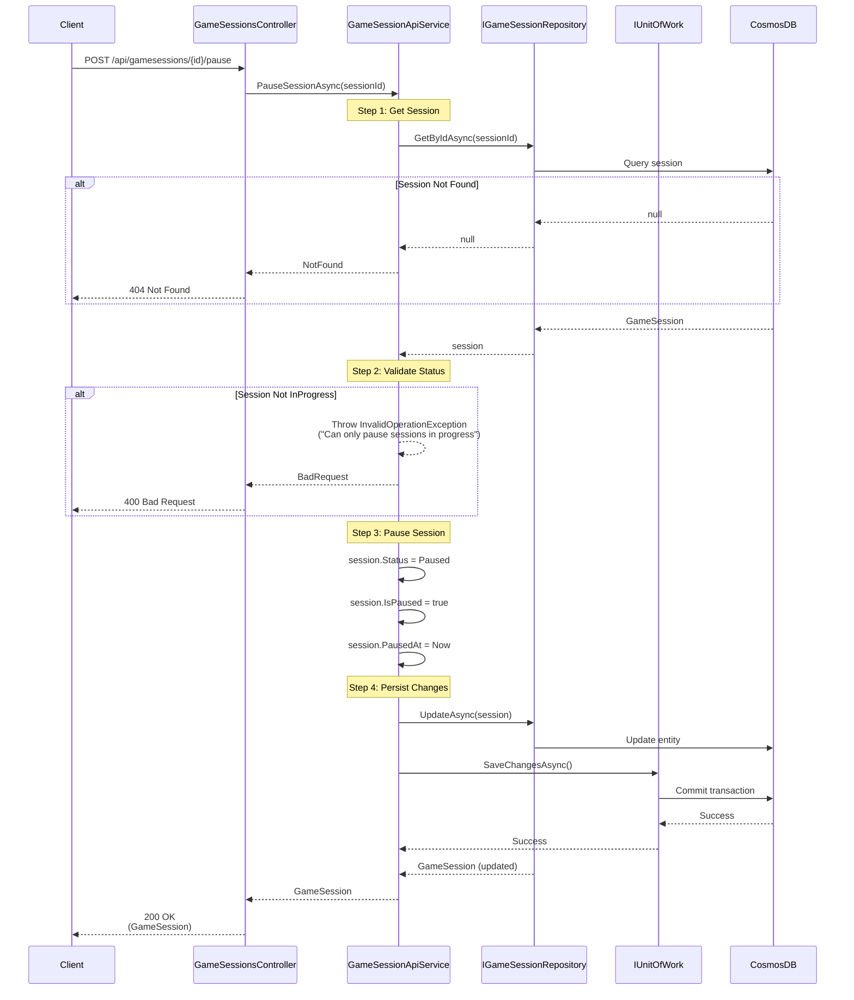

# Pause Game Session Use Case

## Overview

The `PauseSessionAsync` method in `GameSessionApiService` handles pausing an active game session.

## Use Case Details

**Class**: `Mystira.App.Api.Services.GameSessionApiService` (Service Layer)

**Input**: `string sessionId`

**Output**: `GameSession?` (domain model, null if not found)

**Status**: Currently in production (should be migrated to use case)

## Sequence Diagram



## Use Case Flow

### 1. Session Retrieval

- Loads session from database by ID
- Returns null if session doesn't exist

### 2. Status Validation

- Validates session is in `InProgress` status
- Throws `InvalidOperationException` if session is not in progress

### 3. Pause Operation

- Changes status from `InProgress` to `Paused`
- Sets `IsPaused` flag to true
- Sets `PausedAt` timestamp to current UTC time

### 4. Persistence

- Updates session in database
- Commits transaction

## State Transitions

``` text
InProgress → Paused
```

## Elapsed Time Handling

When paused, elapsed time calculation accounts for pause duration:

- `GetTotalElapsedTime()` includes paused time
- `ElapsedTime` property stores time before pause
- Paused duration calculated as `Now - PausedAt` when resuming

## Error Handling

- **Session Not Found**: Returns `null` (handled as 404)
- **Invalid Status**: Returns `InvalidOperationException` (handled as 400)
- **Database Error**: Logs error and rethrows exception

## Migration to Use Case

**Recommended**: Create `PauseGameSessionUseCase` in `Application.UseCases.GameSessions`

**Benefits**:

- Consistent with other game session use cases
- Better testability
- Clear separation of concerns
- Follows hexagonal architecture pattern

## Related Documentation

- [Resume Game Session Use Case](./resume-game-session.md)
- [End Game Session Use Case](./end-game-session.md)
- [Game Session Domain Model](../../domain/models/game-session.md)

