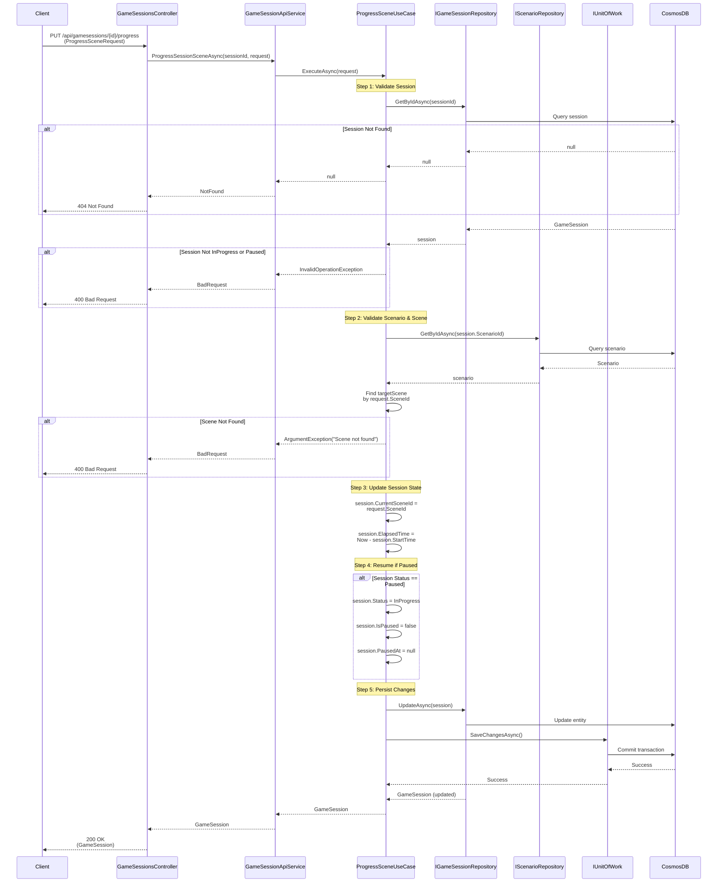

# Progress Scene Use Case

## Overview

The `ProgressSceneUseCase` allows advancing to a specific scene in a game session, supporting pause/resume functionality.

## Use Case Details

**Class**: `Mystira.App.Application.UseCases.GameSessions.ProgressSceneUseCase`

**Input**: `ProgressSceneRequest`

**Output**: `GameSession` (updated domain model)

## Sequence Diagram

## Use Cases

### Direct Scene Navigation

Allows jumping to any scene in the scenario (useful for testing, debugging, or admin features).

### Pause/Resume

- If session is paused, progressing to a scene automatically resumes it
- Status changes from `Paused` to `InProgress`
- `IsPaused` flag is cleared
- `PausedAt` timestamp is cleared

## Validation

1. **Session Exists**: Session must be found in database
2. **Session Status**: Must be `InProgress` or `Paused`
3. **Scenario Exists**: Scenario must exist for the session
4. **Scene Exists**: Target scene must exist in the scenario

## State Updates

- `CurrentSceneId`: Updated to target scene ID
- `ElapsedTime`: Recalculated from start time
- `Status`: Changed to `InProgress` if paused
- `IsPaused`: Cleared if paused
- `PausedAt`: Cleared if paused

## Error Handling

- **Session Not Found**: Returns `null` (handled as 404)
- **Invalid Status**: Returns `InvalidOperationException`
- **Scene Not Found**: Returns `ArgumentException` with scene ID
- **Database Error**: Logs error and rethrows exception

## Related Documentation

- [Create Game Session Use Case](./create-game-session.md)
- [Make Choice Use Case](./make-choice.md)
- [Game Session Domain Model](../../domain/models/game-session.md)
