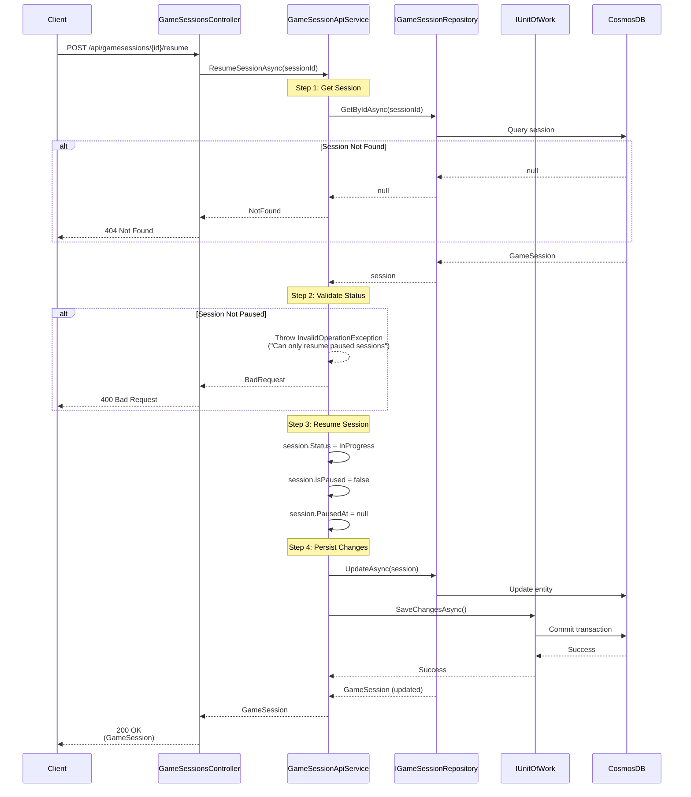

# Resume Game Session Use Case

## Overview

The `ResumeSessionAsync` method in `GameSessionApiService` handles resuming a paused game session. This is used when a user returns to an active adventure from the home page.

## Use Case Details

**Class**: `Mystira.App.Api.Services.GameSessionApiService` (Service Layer)

**Input**: `string sessionId`

**Output**: `GameSession?` (domain model, null if not found)

**Status**: Not currently in production (feature exists but may not be fully integrated)

## Sequence Diagram



## Use Case Flow

### 1. Session Retrieval

- Loads session from database by ID
- Returns null if session doesn't exist

### 2. Status Validation

- Validates session is in `Paused` status
- Throws `InvalidOperationException` if session is not paused

### 3. Resume Operation

- Changes status from `Paused` to `InProgress`
- Clears `IsPaused` flag
- Clears `PausedAt` timestamp

### 4. Persistence

- Updates session in database
- Commits transaction

## Integration with Active Adventures

This use case is typically called when:

- User navigates to home page
- System detects in-progress sessions for the account
- User selects "Resume Adventure" for a paused session

## State Transitions

``` text
Paused → InProgress
```

## Error Handling

- **Session Not Found**: Returns `null` (handled as 404)
- **Invalid Status**: Returns `InvalidOperationException` (handled as 400)
- **Database Error**: Logs error and rethrows exception

## Related Documentation

- [Create Game Session Use Case](./create-game-session.md)
- [End Game Session Use Case](./end-game-session.md)
- [Game Session Domain Model](../../domain/models/game-session.md)
