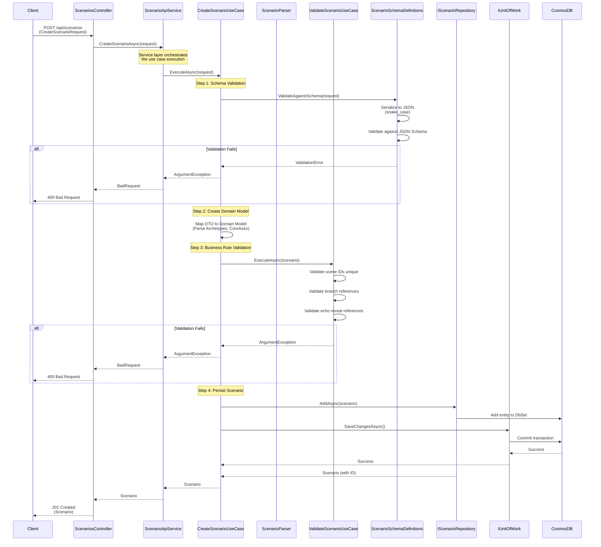
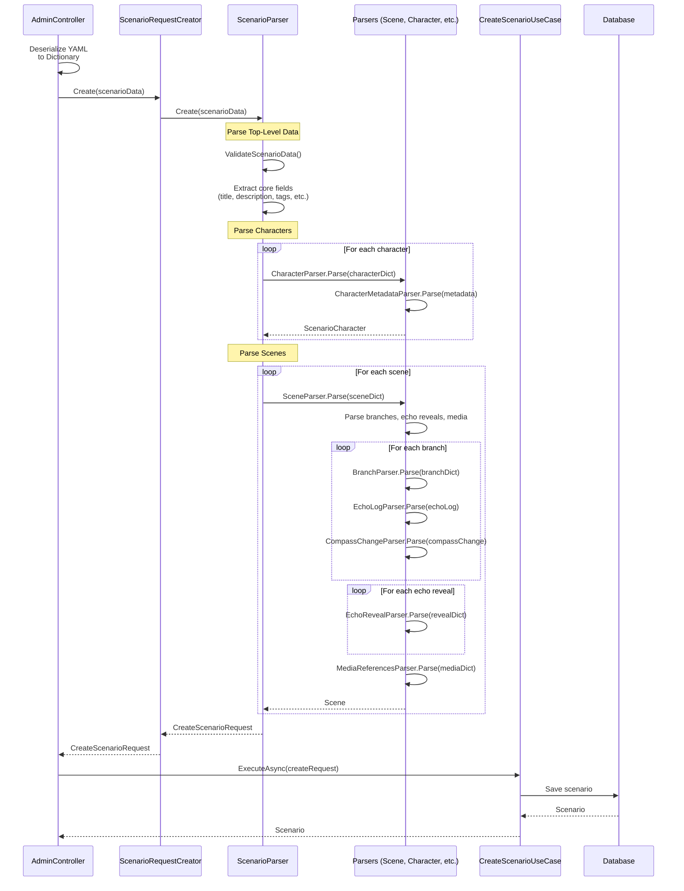

# Create Scenario Use Case

## Overview

The `CreateScenarioUseCase` handles the creation of new game scenarios with comprehensive validation and parsing support.

## Use Case Details

**Class**: `Mystira.App.Application.UseCases.Scenarios.CreateScenarioUseCase`

**Input**: `CreateScenarioRequest`

**Output**: `Scenario` (domain model)

## Sequence Diagram

## Alternative Flow: YAML Import

When importing from YAML (Admin API), the flow includes parsing:

## Parser Elements Used

All parser elements are fully implemented:

1. **ScenarioParser**

   - Validates required fields (title, description, tags, difficulty, etc.)
   - Parses core axes (supports both `core_axes` and `compass_axes`)
   - Delegates to CharacterParser and SceneParser

2. **CharacterParser**

   - Parses character ID, name, image, audio
   - Delegates to CharacterMetadataParser for metadata

3. **CharacterMetadataParser**

   - Parses role, archetype, traits (supports single string or list)
   - Parses species, age, backstory (required fields)
   - Converts archetype strings to Archetype domain objects

4. **SceneParser**

   - Parses scene ID, title, description, type, difficulty
   - Parses next scene ID (supports multiple naming conventions)
   - Delegates to MediaReferencesParser, BranchParser, EchoRevealParser

5. **BranchParser**

   - Parses choice text (supports `choice`, `text`, `option`)
   - Parses next scene ID (supports multiple naming conventions)
   - Delegates to EchoLogParser and CompassChangeParser

6. **EchoLogParser**

   - Parses echo type (supports multiple naming conventions)
   - Parses description, strength (with validation 0.1-1.0)
   - Parses timestamp (optional, defaults to UTC now)

7. **CompassChangeParser**

   - Parses axis (required)
   - Parses delta (required, validated -1.0 to 1.0)
   - Parses developmental link (optional)

8. **EchoRevealParser**

   - Parses echo type (required)
   - Parses min strength (defaults to 0.5, validated 0.1-1.0)
   - Parses trigger scene ID (required)
   - Parses reveal mechanic (optional, validates: mirror/dream/spirit/none)
   - Parses max age scenes (optional, defaults to 10)
   - Parses required flag (optional, defaults to false)

9. **MediaReferencesParser**

   - Parses image, audio, video references
   - Supports case-insensitive field names

## Validation Layers

1. **Schema Validation** (JSON Schema)

   - Validates structure and types
   - Uses NJsonSchema with snake_case serialization

2. **Business Rule Validation** (ValidateScenarioUseCase)

   - Scene IDs must be unique
   - Branch NextSceneId must reference valid scene IDs
   - Echo reveal TriggerSceneId must reference valid scene IDs

3. **Domain Validation** (Domain Models)

   - Enum parsing (DifficultyLevel, SessionLength, SceneType, EchoType)
   - StringEnum parsing (Archetype, CoreAxis)
   - Value constraints (compass delta, echo strength)

## Error Handling

- **Schema Validation Failure**: Returns `ArgumentException` with validation errors
- **Business Rule Violation**: Returns `ArgumentException` with specific rule violation
- **Database Error**: Logs error and rethrows exception
- **Parser Errors**: Throws `DataException` or `ArgumentException` with field-specific messages

## Related Documentation

- [Parser Documentation](../../architecture/patterns/PARSERS.md)
- [Scenario Domain Model](../../domain/models/scenario.md)
- [Validation Schema](../../application/validation/scenario-schema.md)
