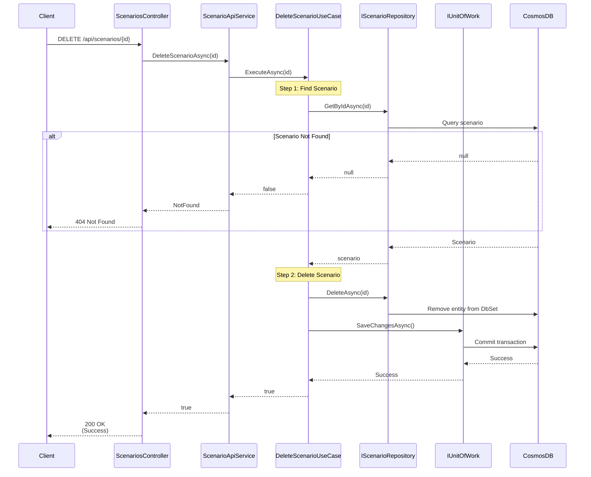

# Delete Scenario Use Case

## Overview

The `DeleteScenarioUseCase` handles deletion of scenarios by ID.

## Use Case Details

**Class**: `Mystira.App.Application.UseCases.Scenarios.DeleteScenarioUseCase`

**Input**: `string id`

**Output**: `bool` (true if deleted, false if not found)

## Sequence Diagram

## Deletion Process

1. **Find Scenario**: Retrieves scenario to verify existence and log details
2. **Delete**: Removes scenario from database
3. **Commit**: Saves changes transactionally

## Behavior

- **Idempotent**: Returns `false` if scenario doesn't exist (no error)
- **Transactional**: Deletion is atomic
- **Logged**: Logs deletion with scenario ID and title

## Cascading Behavior

Currently, deletion does not cascade to:

- Game sessions referencing the scenario (sessions remain)
- User badges earned in scenarios (badges remain)

**Note**: Consider adding cascade deletion or soft deletion if referential integrity is required.

## Error Handling

- **Scenario Not Found**: Returns `false` (not an error)
- **Database Error**: Logs error and rethrows exception

## Related Documentation

- [Create Scenario Use Case](./create-scenario.md)
- [Scenario Domain Model](../../domain/models/scenario.md)
