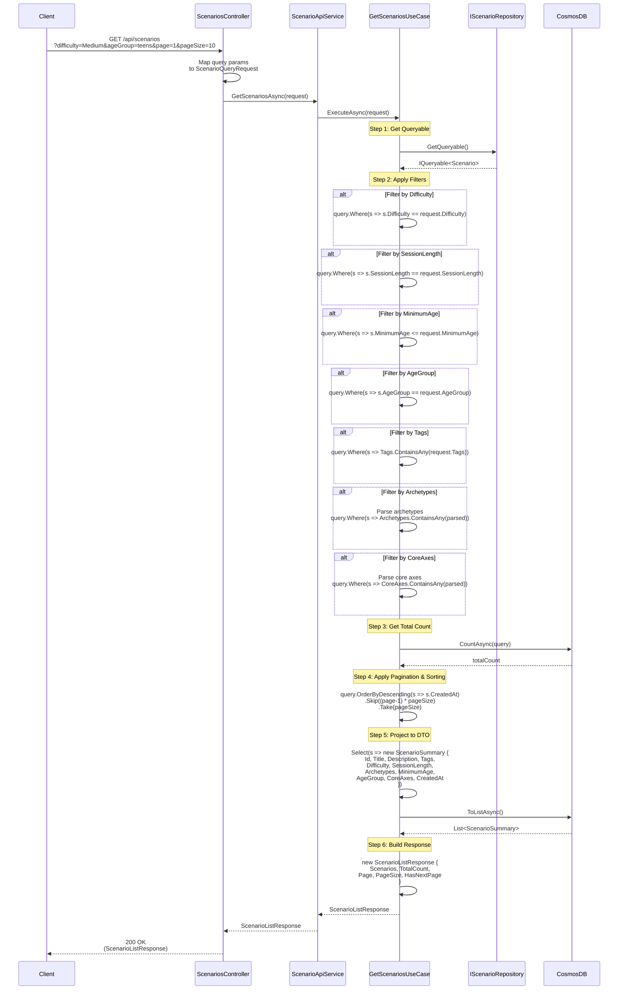

# Get Scenarios Use Case

## Overview

The `GetScenariosUseCase` retrieves scenarios with advanced filtering, sorting, and pagination capabilities.

## Use Case Details

**Class**: `Mystira.App.Application.UseCases.Scenarios.GetScenariosUseCase`

**Input**: `ScenarioQueryRequest`

**Output**: `ScenarioListResponse`

## Sequence Diagram

## Filtering Options

### Supported Filters

1. **Difficulty**: Exact match (`Easy`, `Medium`, `Hard`)
2. **SessionLength**: Exact match (`Short`, `Medium`, `Long`)
3. **MinimumAge**: Less than or equal (`MinimumAge <= request.MinimumAge`)
4. **AgeGroup**: Exact match (`school`, `preteens`, `teens`)
5. **Tags**: Contains any (`s.Tags.ContainsAny(request.Tags)`)
6. **Archetypes**: Contains any (parsed to `Archetype` domain objects)
7. **CoreAxes**: Contains any (parsed to `CoreAxis` domain objects)

### Filter Combination

All filters are combined with AND logic - scenarios must match all specified filters.

## Pagination

- **Page**: 1-based page number (default: 1)
- **PageSize**: Number of items per page (default: 10)
- **HasNextPage**: Calculated as `(Page * PageSize) < TotalCount`

## Sorting

Scenarios are sorted by `CreatedAt` in descending order (newest first).

## Performance Considerations

- Uses `IQueryable<T>` for database-level filtering (efficient)
- Total count query executed before pagination
- Projection to DTO happens at database level (reduces data transfer)
- Archetype and CoreAxis parsing happens in memory (small dataset)

## Related Documentation

- [Scenario Domain Model](../../domain/models/scenario.md)
- [Scenario Query Request](../../contracts/requests/scenarios.md)
