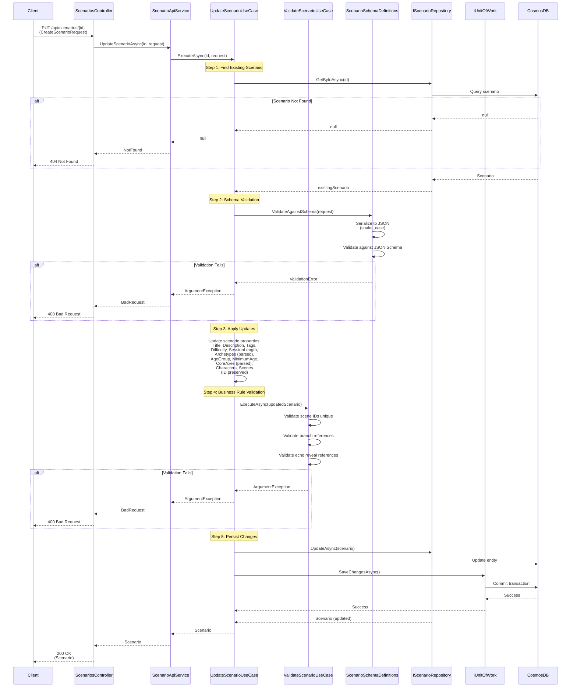

# Update Scenario Use Case

## Overview

The `UpdateScenarioUseCase` updates an existing scenario with full validation, similar to creation but preserves the scenario ID.

## Use Case Details

**Class**: `Mystira.App.Application.UseCases.Scenarios.UpdateScenarioUseCase`

**Input**: `string id`, `CreateScenarioRequest`

**Output**: `Scenario?` (updated domain model, null if not found)

## Sequence Diagram

## Update Process

1. **Retrieve Existing**: Loads current scenario from database
2. **Schema Validation**: Validates request against JSON schema
3. **Apply Updates**: Maps DTO properties to domain model (preserves ID)
4. **Business Validation**: Validates updated scenario business rules
5. **Persist**: Saves changes to database

## Preserved Properties

- **ID**: Scenario ID is never changed
- **CreatedAt**: Original creation timestamp preserved
- **Relationships**: Existing relationships maintained

## Updated Properties

All properties from `CreateScenarioRequest` are updated:

- Title, Description, Tags
- Difficulty, SessionLength
- Archetypes (parsed from strings)
- AgeGroup, MinimumAge
- CoreAxes (parsed from strings)
- Characters (full replacement)
- Scenes (full replacement)

## Validation

Same validation as creation:

- JSON schema validation
- Business rule validation (scene references, branch references)
- Domain model validation (enum parsing, value constraints)

## Error Handling

- **Scenario Not Found**: Returns `null` (handled as 404)
- **Schema Validation Failure**: Returns `ArgumentException` with errors
- **Business Rule Violation**: Returns `ArgumentException` with specific violation
- **Database Error**: Logs error and rethrows exception

## Related Documentation

- [Create Scenario Use Case](./create-scenario.md)
- [Validate Scenario Use Case](./validate-scenario.md)
- [Scenario Domain Model](../../domain/models/scenario.md)
