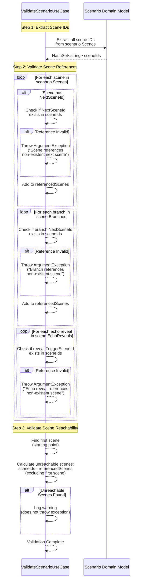

# Validate Scenario Use Case

## Overview

The `ValidateScenarioUseCase` validates scenario business rules, ensuring scene references are valid and scenes are reachable.

## Use Case Details

**Class**: `Mystira.App.Application.UseCases.Scenarios.ValidateScenarioUseCase`

**Input**: `Scenario` (domain model)

**Output**: `Task` (throws exception on validation failure)

## Sequence Diagram

## Validation Rules

### 1. Scene ID Uniqueness

- All scene IDs must be unique within the scenario
- Enforced by domain model structure

### 2. Next Scene References

- `Scene.NextSceneId` must reference a valid scene ID
- Throws `ArgumentException` if reference is invalid

### 3. Branch References

- `Branch.NextSceneId` must reference a valid scene ID
- Throws `ArgumentException` if reference is invalid

### 4. Echo Reveal References

- `EchoReveal.TriggerSceneId` must reference a valid scene ID
- Throws `ArgumentException` if reference is invalid

### 5. Scene Reachability (Warning Only)

- All scenes (except the first) should be reachable
- Unreachable scenes are logged as warnings (not errors)
- Allows for future scenes or alternative paths

## Validation Flow

1. **Extract Scene IDs**: Creates set of all scene IDs
2. **Validate References**: Checks all scene, branch, and echo reveal references
3. **Check Reachability**: Identifies unreachable scenes (warning only)

## Error Messages

- `"Scene '{sceneId}' references non-existent next scene '{nextSceneId}'"`
- `"Scene '{sceneId}' branch references non-existent scene '{nextSceneId}'"`
- `"Scene '{sceneId}' echo reveal references non-existent scene '{triggerSceneId}'"`
- `"Scenario must have at least one scene"`

## Usage

This use case is called by:

- `CreateScenarioUseCase` - Before saving new scenario
- `UpdateScenarioUseCase` - Before saving updated scenario

## Related Documentation

- [Create Scenario Use Case](./create-scenario.md)
- [Update Scenario Use Case](./update-scenario.md)
- [Scenario Domain Model](../../domain/models/scenario.md)
