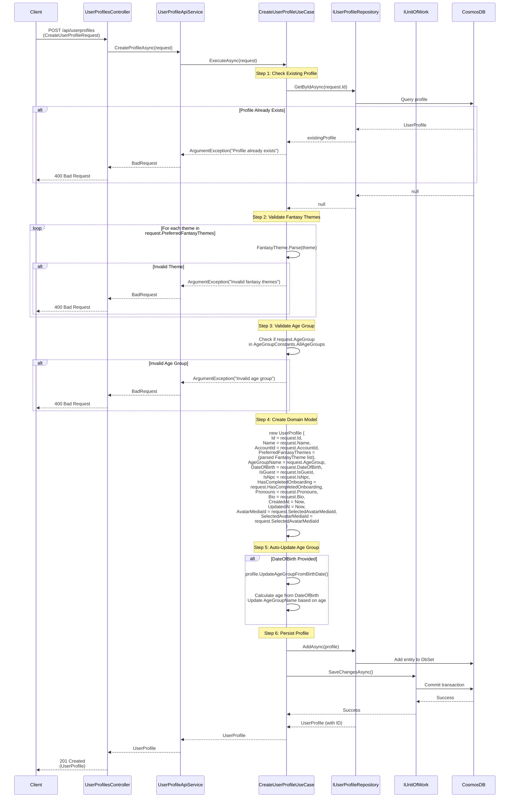

# Create User Profile Use Case

## Overview

The `CreateUserProfileUseCase` handles creation of new user profiles with comprehensive validation.

## Use Case Details

**Class**: `Mystira.App.Application.UseCases.UserProfiles.CreateUserProfileUseCase`

**Input**: `CreateUserProfileRequest`

**Output**: `UserProfile` (domain model)

## Sequence Diagram

## Validation

### 1. Profile Uniqueness

- Checks if profile with same ID already exists
- Throws `ArgumentException` if duplicate

### 2. Fantasy Themes Validation

- Each theme must parse to valid `FantasyTheme` domain object
- Invalid themes cause `ArgumentException` with list of invalid themes

### 3. Age Group Validation

- Age group must be in `AgeGroupConstants.AllAgeGroups`
- Valid values: `school`, `preteens`, `teens`
- Invalid age group causes `ArgumentException`

### 4. Age Group Auto-Update

- If `DateOfBirth` is provided, age group is automatically calculated
- Uses `UpdateAgeGroupFromBirthDate()` domain method
- Overrides explicitly set age group if date of birth provided

## Profile Properties

### Required Properties

- `Id`: Profile identifier (from request)
- `Name`: Profile name
- `AccountId`: Parent account ID
- `AgeGroupName`: Age group (validated)

### Optional Properties

- `PreferredFantasyThemes`: List of fantasy themes (validated)
- `DateOfBirth`: Date of birth (triggers age group update)
- `IsGuest`: Guest profile flag
- `IsNpc`: NPC profile flag
- `HasCompletedOnboarding`: Onboarding completion flag
- `Pronouns`: User pronouns
- `Bio`: Profile biography
- `SelectedAvatarMediaId`: Avatar media ID

### Auto-Generated Properties

- `CreatedAt`: Set to current UTC time
- `UpdatedAt`: Set to current UTC time

## Error Handling

- **Profile Exists**: Returns `ArgumentException` with profile name
- **Invalid Fantasy Themes**: Returns `ArgumentException` with invalid themes list
- **Invalid Age Group**: Returns `ArgumentException` with valid options
- **Database Error**: Logs error and rethrows exception

## Related Documentation

- [Update User Profile Use Case](./update-user-profile.md)
- [User Profile Domain Model](../../domain/models/user-profile.md)
- [Fantasy Themes](../../domain/models/fantasy-theme.md)
