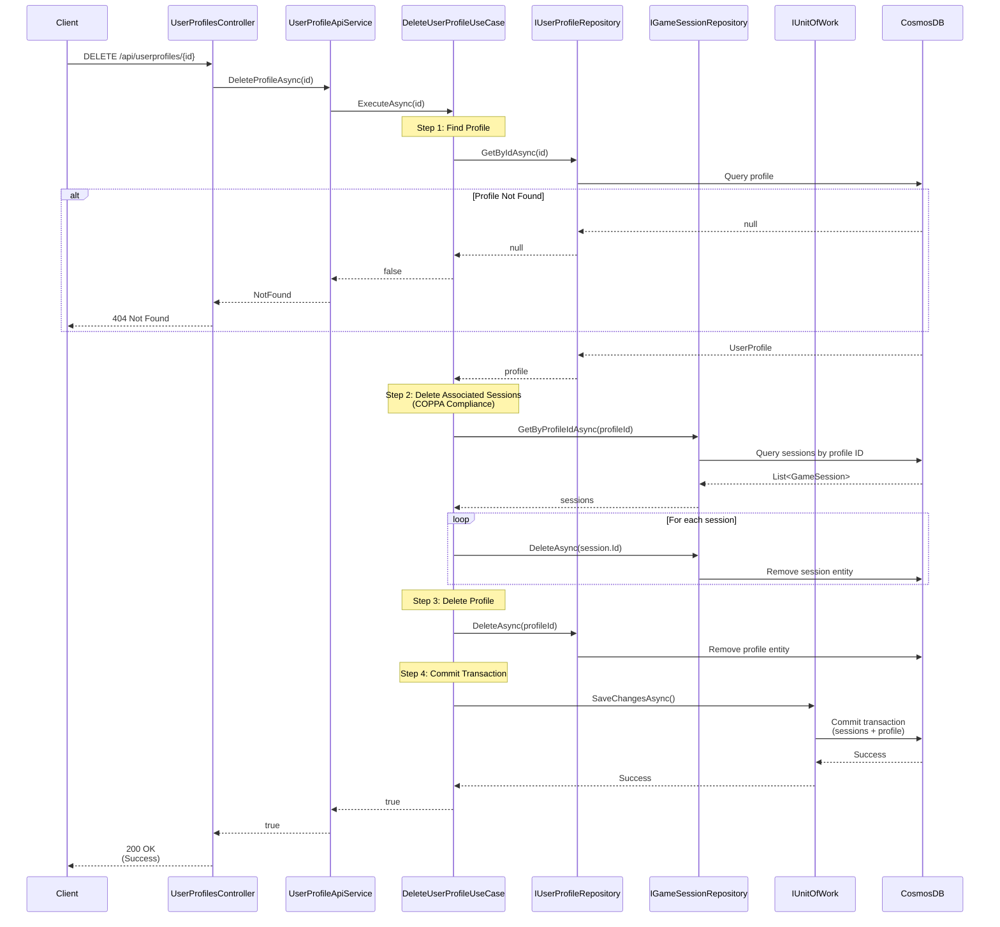

# Delete User Profile Use Case

## Overview

The `DeleteUserProfileUseCase` handles deletion of user profiles and associated data for COPPA compliance.

## Use Case Details

**Class**: `Mystira.App.Application.UseCases.UserProfiles.DeleteUserProfileUseCase`

**Input**: `string id`

**Output**: `bool` (true if deleted, false if not found)

## Sequence Diagram

## COPPA Compliance

For users under 13 (COPPA compliance), all associated data must be deleted:

1. **Game Sessions**: All sessions associated with the profile are deleted
2. **Profile**: The profile itself is deleted
3. **Transaction**: All deletions happen in a single transaction

## Deletion Process

1. **Find Profile**: Retrieves profile to verify existence
2. **Find Sessions**: Retrieves all game sessions for the profile
3. **Delete Sessions**: Deletes each session individually
4. **Delete Profile**: Deletes the profile
5. **Commit**: Saves all deletions transactionally

## Transaction Safety

All deletions are performed within a single `UnitOfWork` transaction:

- If any deletion fails, entire operation rolls back
- Ensures data consistency
- Prevents orphaned records

## Behavior

- **Idempotent**: Returns `false` if profile doesn't exist (no error)
- **Cascading**: Deletes all associated game sessions
- **Transactional**: All deletions atomic
- **Logged**: Logs deletion with profile ID and name

## Additional Data Considerations

Currently deleted:

- ✅ Game sessions

Not currently deleted (consider for future):

- ⚠️ User badges (may want to preserve for analytics)
- ⚠️ User preferences (if stored separately)

## Error Handling

- **Profile Not Found**: Returns `false` (not an error)
- **Database Error**: Logs error and rethrows exception (transaction rolls back)

## Related Documentation

- [Create User Profile Use Case](./create-user-profile.md)
- [User Profile Domain Model](../../domain/models/user-profile.md)
- [COPPA Compliance](../../compliance/coppa.md)
