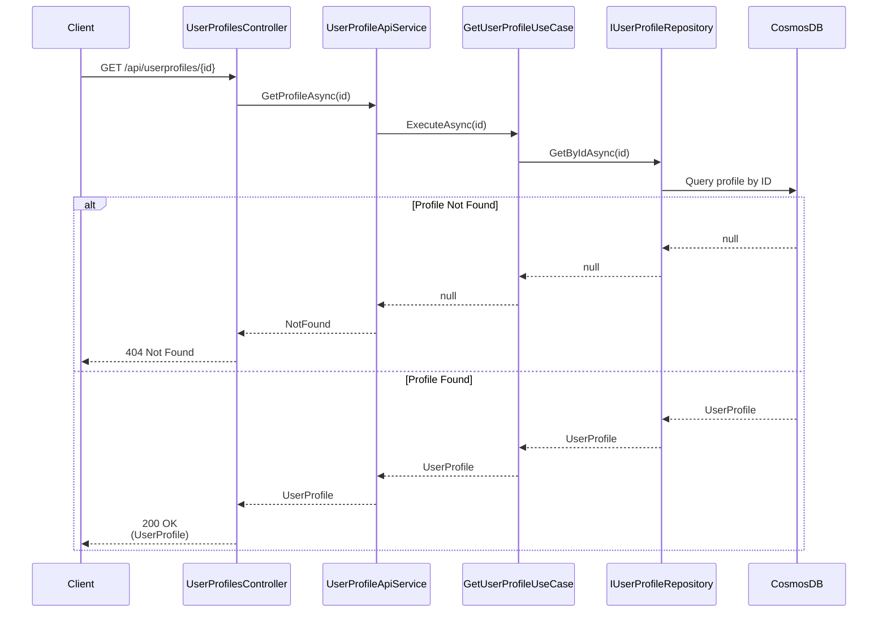

# Get User Profile Use Case

## Overview

The `GetUserProfileUseCase` retrieves a user profile by ID.

## Use Case Details

**Class**: `Mystira.App.Application.UseCases.UserProfiles.GetUserProfileUseCase`

**Input**: `string id`

**Output**: `UserProfile?` (domain model, null if not found)

## Sequence Diagram

## Behavior

- **Simple Lookup**: Direct ID-based retrieval
- **Null Handling**: Returns `null` if profile not found (not an error)
- **Logging**: Logs debug message if profile not found

## Error Handling

- **Profile Not Found**: Returns `null` (handled as 404 by service)
- **Database Error**: Logs error and rethrows exception

## Related Documentation

- [Create User Profile Use Case](./create-user-profile.md)
- [Update User Profile Use Case](./update-user-profile.md)
- [User Profile Domain Model](../../domain/models/user-profile.md)
