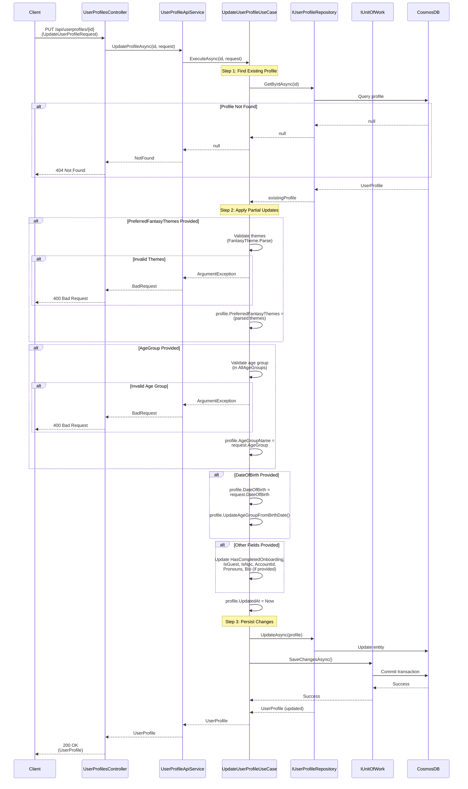

# Update User Profile Use Case

## Overview

The `UpdateUserProfileUseCase` updates an existing user profile with partial updates and validation.

## Use Case Details

**Class**: `Mystira.App.Application.UseCases.UserProfiles.UpdateUserProfileUseCase`

**Input**: `string id`, `UpdateUserProfileRequest`

**Output**: `UserProfile?` (updated domain model, null if not found)

## Sequence Diagram

## Partial Update Support

All fields in `UpdateUserProfileRequest` are optional:

- Only provided fields are updated
- Null fields are ignored
- Validation only applies to provided fields

## Update Fields

### Validated Fields

- **PreferredFantasyThemes**: Validated against `FantasyTheme` domain model
- **AgeGroup**: Validated against `AgeGroupConstants.AllAgeGroups`
- **DateOfBirth**: Triggers automatic age group update

### Direct Update Fields

- **HasCompletedOnboarding**: Boolean flag
- **IsGuest**: Guest profile flag
- **IsNpc**: NPC profile flag
- **AccountId**: Parent account ID
- **Pronouns**: User pronouns
- **Bio**: Profile biography

### Auto-Updated Fields

- **UpdatedAt**: Always set to current UTC time

## Age Group Auto-Update

If `DateOfBirth` is provided:

- Updates `DateOfBirth` property
- Calls `UpdateAgeGroupFromBirthDate()` domain method
- Automatically calculates and updates age group based on age

## Validation

Same validation as creation:

- Fantasy themes must parse to valid `FantasyTheme` objects
- Age group must be in valid age groups list
- Date of birth triggers age group recalculation

## Error Handling

- **Profile Not Found**: Returns `null` (handled as 404)
- **Invalid Fantasy Themes**: Returns `ArgumentException` with invalid themes
- **Invalid Age Group**: Returns `ArgumentException` with valid options
- **Database Error**: Logs error and rethrows exception

## Related Documentation

- [Create User Profile Use Case](./create-user-profile.md)
- [User Profile Domain Model](../../domain/models/user-profile.md)
